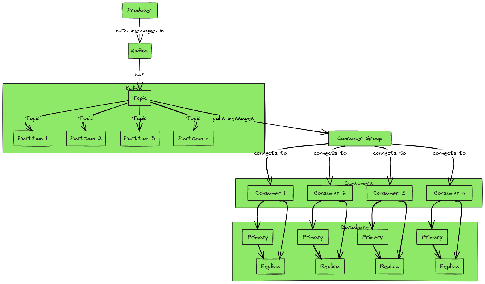

# TradeTornado

This project is an Order Matching Service developed using Go and Kafka. It is designed to efficiently process and match orders in real-time. 

## System Overview

Below is the flow of the system, detailed in the diagram:



## Getting Started

These instructions will get you a copy of the project up and running on your local machine for development and testing purposes.

### Prerequisites

What things you need to install the software and how to install them:

- Docker
- Docker Compose

You can download Docker here: [Get Docker](https://docs.docker.com/get-docker/)
Docker Compose is included in most Docker Desktop installations. Check the [official guide](https://docs.docker.com/compose/install/) for more details.

### Installing

A step-by-step series of examples that tell you how to get a development environment running:

1. Clone the repository:
   ```bash
   git clone https://github.com/yourusername/TradeTornado.git
2. Go to project root:
   ```bash
   cd TradeTornado
3. Run using docker compose:
   ```bash
   docker compose up

This will pull the necessary Docker images, build your service, and start it along with its dependencies. Your service should now be running and accessible.

### Usage
You can find the document for the orders endpoint [here](https://app.swaggerhub.com/apis/Armingodiz/trade-tornado_api/1.0.0)
